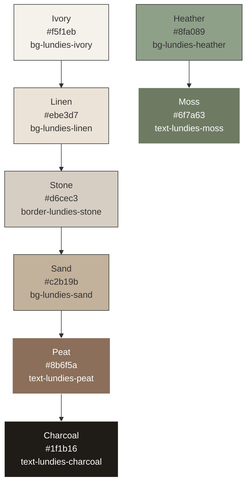

# Ensure Consistent Website Theme and Colors

## Overview

This document outlines the approach to ensure consistent theme and colors across all pages of the Schiehallion Hotel website. The restaurant page at `/restaurant` currently has theme inconsistencies compared to other pages like the homepage and rooms page. This design addresses the issue by establishing a unified theme system using the existing Tailwind CSS configuration.

## Current Theme Analysis

### Global Color Palette
The website uses a custom color palette defined in `tailwind.config.js`:



### Theme Inconsistencies Identified
1. **Restaurant Page (`/restaurant/page.tsx`)**:
   - Uses different background colors (`bg-white`, `dark:bg-gray-900`)
   - Inconsistent text colors (`text-lundies-charcoal` vs other colors)
   - Different border colors (`border-lundies-stone/20` vs inconsistent borders)
   - Missing proper dark mode support aligned with global theme

2. **Other Pages (Homepage, Rooms)**:
   - Properly use the `lundies` color palette
   - Consistent background (`bg-lundies-ivory`)
   - Consistent text colors (`text-lundies-charcoal`)
   - Proper dark mode support with appropriate contrast

## Solution Architecture

### 1. Theme Consistency Approach
- Standardize all pages to use the `lundies` color palette
- Ensure consistent background, text, and border colors
- Implement proper dark mode support using the existing Tailwind dark mode classes
- Update the restaurant page to match the theme of other pages

### 2. Component Updates
- Update the restaurant page layout to use consistent background colors
- Standardize text colors across all elements
- Align border colors with the global theme
- Ensure interactive elements use the primary action color (`lundies.heather`)

### 3. CSS Custom Properties Utilization
- Leverage existing CSS custom properties in `globals.css` for background gradients
- Ensure all pages use the same base background styling
- Maintain consistent radial gradient patterns across pages

## Implementation Plan

### Phase 1: Restaurant Page Theme Alignment
1. Update the main background to use `bg-lundies-ivory` instead of `bg-white`
2. Replace text colors with `text-lundies-charcoal` for primary text
3. Standardize border colors to use `border-lundies-stone`
4. Update card backgrounds to use `bg-white/90` with proper dark mode support
5. Align button styles with the global theme
6. Update form elements to use consistent styling
7. Ensure table elements have proper color coding

### Phase 2: Global Theme Verification
1. Verify all pages use the consistent `lundies` color palette
2. Ensure dark mode works consistently across all pages
3. Check that all interactive elements use the primary action color
4. Validate that all pages have consistent spacing and padding
5. Confirm that all pages use the same background gradient patterns

## Detailed Design

### Restaurant Page Updates

#### Main Layout
Replace the current main element:
```jsx
// Current
<main className="min-h-screen bg-white pb-16 pt-10 dark:bg-gray-900">

// Updated
<main className="min-h-screen bg-lundies-ivory pb-16 pt-10 dark:bg-lundies-charcoal">
```

#### Header Section
Update the header to use consistent background and border colors:
```jsx
// Current
<header className="rounded-2xl bg-white p-8 shadow-sm ring-1 ring-lundies-charcoal/5 dark:bg-lundies-charcoal dark:ring-white/10">

// Updated
<header className="rounded-2xl bg-white/90 p-8 shadow-sm ring-1 ring-lundies-stone/5 dark:bg-lundies-charcoal/90 dark:ring-lundies-stone/10">
```

#### Time Slot Management Section
Standardize the section backgrounds:
```jsx
// Current
<section className="rounded-2xl border border-lundies-stone/20 bg-white p-6 shadow-sm dark:border-lundies-charcoal dark:bg-lundies-charcoal">

// Updated
<section className="rounded-2xl border border-lundies-stone/20 bg-white/90 p-6 shadow-sm dark:border-lundies-stone dark:bg-lundies-charcoal/90">
```

#### Floor Plan Container
Update the floor plan container styling:
```jsx
// Current
<div className="relative overflow-hidden rounded-2xl border border-lundies-stone/20 bg-lundies-linen shadow-inner dark:border-lundies-charcoal dark:bg-lundies-charcoal">

// Updated
<div className="relative overflow-hidden rounded-2xl border border-lundies-stone/20 bg-lundies-linen shadow-inner dark:border-lundies-stone dark:bg-lundies-charcoal/80">
```

#### Table Elements
Update all table elements to use consistent colors with proper dark mode support:
- Available tables: `bg-lundies-heather` with `text-white` and `border-lundies-heather`
- Reserved tables: `bg-lundies-peat/20` with `text-lundies-peat` and `border-lundies-peat`
- Held tables: `bg-lundies-sand/20` with `text-lundies-sand` and `border-lundies-sand`
- Maintenance tables: `bg-lundies-stone/20` with `text-lundies-stone` and `border-lundies-stone`
- Selected tables: Add `ring-2 ring-lundies-heather` for visual indication

#### Interactive Elements
Update buttons and form elements to use consistent styling:
- Primary buttons: `bg-lundies-heather` with `text-lundies-charcoal` and hover states
- Secondary buttons: `border-lundies-heather` with `text-lundies-heather`
- Form inputs: Standardize with `border-lundies-stone/30`, `dark:border-lundies-stone`, `dark:bg-lundies-charcoal`, and `dark:text-lundies-linen`
- Select dropdowns: Use the same styling as form inputs
- Action buttons: Consistent padding, rounded corners, and focus states

### CSS Custom Properties Update
Ensure the global CSS custom properties in `globals.css` are properly utilized:
```css
:root {
  color-scheme: light;
  --surface-base: 245 241 235; /* lundies.ivory */
  --surface-muted: 235 227 215; /* lundies.linen */
  --surface-accent: 214 206 195; /* lundies.stone */
  --accent-green: 143 160 137; /* lundies.heather */
  --accent-brown: 139 111 90; /* lundies.peat */
  --text-primary: 31 27 22; /* lundies.charcoal */
  --text-muted: 111 122 99; /* lundies.moss */
}
```

These CSS custom properties are already utilized in the global background styling in `globals.css`:
```css
body {
  min-height: 100vh;
  color: rgb(var(--text-primary));
  background-color: rgb(var(--surface-base));
  background:
    radial-gradient(circle at 18% 18%, rgba(var(--accent-green) / 0.18), transparent 55%),
    radial-gradient(circle at 82% 8%, rgba(var(--accent-brown) / 0.12), transparent 45%),
    linear-gradient(
      to bottom,
      rgb(var(--surface-base)),
      rgb(var(--surface-muted)) 45%,
      rgb(var(--surface-accent))
    );
  /* ... */
}
```

## Testing Strategy

### Visual Consistency Testing
1. Compare all pages side-by-side to ensure consistent color usage
2. Test light and dark mode on all pages
3. Verify interactive elements have consistent styling
4. Check that all text maintains proper contrast ratios

### Cross-Browser Testing
1. Test theme consistency across Chrome, Firefox, Safari, and Edge
2. Verify mobile responsiveness maintains theme consistency
3. Check that all interactive elements work properly with the new theme

### Automated Testing
1. Add CSS linting rules to enforce color palette usage
2. Implement visual regression tests to catch theme inconsistencies
3. Add accessibility tests to ensure proper color contrast

### Theme Consistency Checklist
| Element | Current Class | Updated Class | Status |
|---------|---------------|---------------|--------|
| Main background | `bg-white dark:bg-gray-900` | `bg-lundies-ivory dark:bg-lundies-charcoal` |  |
| Header background | `bg-white dark:bg-lundies-charcoal` | `bg-white/90 dark:bg-lundies-charcoal/90` |  |
| Section backgrounds | Various | `bg-white/90 dark:bg-lundies-charcoal/90` |  |
| Text colors | Various | `text-lundies-charcoal dark:text-white` |  |
| Border colors | Various | `border-lundies-stone/20 dark:border-lundies-stone` |  |
| Primary buttons | Various | `bg-lundies-heather text-lundies-charcoal` |  |
| Secondary buttons | Various | `border-lundies-heather text-lundies-heather` |  |
| Form elements | Various | `border-lundies-stone/30 dark:border-lundies-stone dark:bg-lundies-charcoal dark:text-lundies-linen` |  |

## Rollout Plan

### Phase 1: Development
1. Implement theme updates on the restaurant page
2. Create a theme consistency checklist
3. Develop automated tests for color usage

### Phase 2: Review
1. Conduct visual review of all pages using the checklist
2. Verify dark mode implementation across all components
3. Test interactive elements for consistent styling
4. Validate accessibility and contrast ratios

### Phase 3: Deployment
1. Deploy to staging environment
2. Conduct cross-browser and device testing
3. Perform accessibility audit
4. Deploy to production after approval

## Success Metrics

1. **Visual Consistency**: All pages use the same color palette consistently with no visual jarring when navigating between pages
2. **Theme Switching**: Light and dark modes work seamlessly across all pages with consistent contrast ratios
3. **User Experience**: Improved visual cohesion and professional appearance across the entire website
4. **Accessibility**: All text maintains proper contrast ratios (WCAG AA compliant) in both light and dark modes
5. **Maintainability**: Theme updates can be made globally by modifying the Tailwind configuration