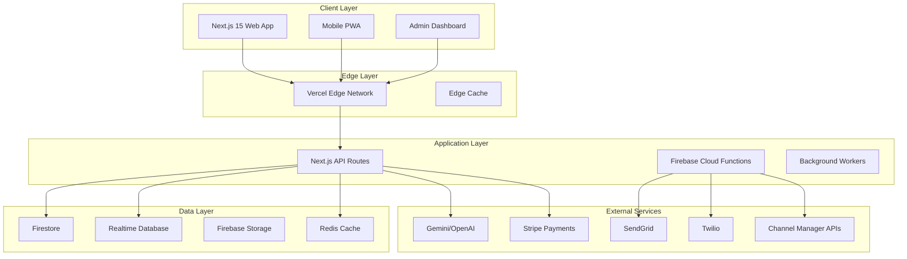

# Schiehallion Hotel - Technical Architecture Documentation

## System Architecture Overview

The Schiehallion Hotel platform extends the Nano Banana blueprint into a comprehensive hospitality management system. This document details the technical implementation, data flows, and operational considerations for the hotel booking and management platform.

---

## 1. High-Level Architecture



---

## 2. Core Components Architecture

### 2.1 Frontend Architecture

```typescript
// Component Hierarchy
src/
├── app/
│   ├── layout.tsx                 // Root layout with providers
│   ├── page.tsx                   // Landing page
│   ├── rooms/
│   │   ├── page.tsx              // Room listing
│   │   └── [id]/page.tsx         // Room detail
│   ├── booking/
│   │   ├── page.tsx              // Booking flow
│   │   ├── cart/page.tsx         // Multi-room cart
│   │   └── confirm/page.tsx      // Confirmation
│   ├── restaurant/
│   │   ├── page.tsx              // Restaurant info
│   │   └── reserve/page.tsx      // Table booking
│   ├── admin/
│   │   ├── layout.tsx            // Admin layout
│   │   ├── dashboard/page.tsx    // Operations overview
│   │   ├── bookings/page.tsx     // Booking management
│   │   └── revenue/page.tsx      // Revenue optimization
│   └── api/
│       └── [...api routes]       // Server endpoints
│
├── components/
│   ├── booking/
│   │   ├── RoomCalendar.tsx     // Drag-drop calendar
│   │   ├── BookingCart.tsx      // Multi-room cart
│   │   ├── GuestForm.tsx        // Guest details
│   │   └── PaymentForm.tsx      // Stripe Elements
│   ├── restaurant/
│   │   ├── FloorPlan.tsx        // Interactive tables
│   │   ├── TimeSlotPicker.tsx   // Availability slots
│   │   └── ReservationForm.tsx  // Table booking
│   ├── ai/
│   │   ├── ConciergChat.tsx     // AI assistant
│   │   ├── Suggestions.tsx      // Smart recommendations
│   │   └── Translation.tsx      // Language switcher
│   └── shared/
│       ├── Navigation.tsx       // Global nav
│       ├── Footer.tsx          // Global footer
│       └── LoadingStates.tsx   // Skeletons
│
├── contexts/
│   ├── AuthContext.tsx          // Firebase auth + roles
│   ├── BookingContext.tsx       // Booking state
│   ├── CartContext.tsx          // Shopping cart
│   └── AvailabilityContext.tsx  // Real-time availability
│
├── hooks/
│   ├── useBooking.ts           // Booking operations
│   ├── useAvailability.ts      // Real-time checks
│   ├── usePayment.ts           // Stripe integration
│   ├── useDragDrop.ts          // DnD functionality
│   └── useAIAssistant.ts       // Concierge features
│
├── lib/
│   ├── firebase/
│   │   ├── config.ts           // Firebase setup
│   │   ├── auth.ts            // Auth helpers
│   │   ├── firestore.ts       // Database queries
│   │   └── realtime.ts        // RTDB subscriptions
│   ├── stripe/
│   │   ├── client.ts          // Stripe Elements
│   │   └── server.ts          // Payment intents
│   ├── ai/
│   │   ├── providers.ts       // AI service config
│   │   └── prompts.ts         // System prompts
│   └── utils/
│       ├── dates.ts           // Date helpers
│       ├── pricing.ts         // Price calculations
│       └── validation.ts      // Form validation
```

### 2.2 Backend Services Architecture

#### Cloud Functions Structure

```typescript
// Firebase Cloud Functions
functions/
├── src/
│   ├── booking/
│   │   ├── onCreate.ts         // New booking handler
│   │   ├── onConfirm.ts       // Payment confirmation
│   │   ├── onCancel.ts        // Cancellation logic
│   │   └── reminderScheduler.ts // Email reminders
│   ├── restaurant/
│   │   ├── onReservation.ts   // Table booking
│   │   ├── waitlistManager.ts // Waitlist processing
│   │   └── noShowHandler.ts   // No-show management
│   ├── inventory/
│   │   ├── availabilitySync.ts // Real-time sync
│   │   ├── rateManager.ts     // Dynamic pricing
│   │   └── overbookingGuard.ts // Prevent overbooking
│   ├── integrations/
│   │   ├── channelSync.ts     // OTA synchronization
│   │   ├── pmsConnector.ts    // Property management
│   │   └── reviewAggregator.ts // Review collection
│   └── admin/
│       ├── reportGenerator.ts  // Analytics reports
│       ├── forecastEngine.ts  // Occupancy forecasting
│       └── alertSystem.ts     // Operational alerts
```

### 2.3 Data Architecture

#### Database Schema Design

```typescript
// Firestore Collections Structure

// /rooms - Static room inventory
{
  id: "room_001",
  name: "Highland View Double",
  type: "double",
  floor: 2,
  number: "201",
  features: ["ensuite", "loch_view", "king_bed"],
  capacity: { adults: 2, children: 1 },
  size: 28, // square meters
  basePrice: 120,
  images: ["url1", "url2"],
  amenities: {
    wifi: true,
    tv: true,
    minibar: false,
    safe: true
  },
  status: "active", // active, maintenance, unavailable
  metadata: {
    lastCleaned: Timestamp,
    lastMaintenance: Timestamp,
    notes: string
  }
}

// /availability - Real-time availability calendar
// Document ID: YYYY-MM-DD
{
  date: "2025-09-23",
  rooms: {
    "room_001": {
      status: "available", // available, booked, blocked
      bookingId: null,
      price: 145, // dynamic pricing
      minStay: 1,
      checkIn: true,
      checkOut: true
    }
  },
  occupancy: 0.75, // percentage
  totalAvailable: 5,
  totalBooked: 15
}

// /bookings - Guest bookings
{
  id: "booking_12345",
  confirmationCode: "SCH-2025-09-001",
  guest: {
    firstName: "John",
    lastName: "Smith",
    email: "john@example.com",
    phone: "+44 7700 900000",
    address: {
      line1: "123 Main St",
      city: "Edinburgh",
      postcode: "EH1 1AA",
      country: "UK"
    }
  },
  rooms: [
    {
      roomId: "room_001",
      roomName: "Highland View Double",
      checkIn: "2025-09-25T15:00:00",
      checkOut: "2025-09-27T11:00:00",
      guests: { adults: 2, children: 0 },
      rate: 145,
      package: "bed_breakfast"
    }
  ],
  pricing: {
    roomTotal: 290,
    extras: 50,
    taxes: 34,
    total: 374,
    paid: 374,
    balance: 0
  },
  payment: {
    method: "card",
    stripePaymentIntent: "pi_xxx",
    status: "paid",
    paidAt: Timestamp
  },
  status: "confirmed", // pending, confirmed, checked_in, completed, cancelled
  source: "direct", // direct, booking_com, hotels_uk
  specialRequests: "Late arrival after 10pm",
  metadata: {
    createdAt: Timestamp,
    updatedAt: Timestamp,
    checkedInAt: null,
    checkedOutAt: null,
    cancelledAt: null,
    modifiedBy: "system"
  }
}

// /restaurant_tables - Table inventory
{
  id: "table_01",
  number: 1,
  zone: "main_dining",
  capacity: 4,
  minCapacity: 2,
  maxCapacity: 5,
  position: { x: 100, y: 200 }, // for floor plan
  features: ["window", "corner"],
  combinableWith: ["table_02"], // for larger parties
  status: "active"
}

// /table_reservations - Restaurant bookings
{
  id: "res_abc123",
  tableId: "table_01",
  date: "2025-09-23",
  timeSlot: "19:00",
  duration: 120, // minutes
  guest: {
    name: "Jane Doe",
    phone: "+44 7700 900001",
    email: "jane@example.com"
  },
  partySize: 4,
  specialRequests: "Anniversary dinner",
  dietary: ["vegetarian", "nut_allergy"],
  status: "confirmed",
  source: "website",
  createdAt: Timestamp
}

// /users - Extended from Nano Banana
{
  id: "user_xxx",
  email: "staff@schiehallion.com",
  role: "staff", // guest, staff, admin
  profile: {
    firstName: "Alice",
    lastName: "Manager",
    department: "reception"
  },
  permissions: ["bookings.read", "bookings.write", "restaurant.manage"],
  preferences: {
    notifications: true,
    language: "en"
  },
  metadata: {
    lastLogin: Timestamp,
    createdAt: Timestamp
  }
}
```

#### Realtime Database Structure

```json
{
  "availability": {
    "2025-09-23": {
      "rooms": {
        "room_001": {
          "available": true,
          "price": 145
        }
      },
      "restaurant": {
        "18:00": {
          "tables_available": 5,
          "capacity_available": 20
        },
        "18:30": {
          "tables_available": 3,
          "capacity_available": 12
        }
      }
    }
  },
  "live_bookings": {
    "session_xxx": {
      "userId": "anonymous_123",
      "roomId": "room_001",
      "checkIn": "2025-09-25",
      "checkOut": "2025-09-27",
      "expiresAt": 1234567890
    }
  },
  "staff_presence": {
    "user_abc": {
      "status": "online",
      "department": "reception",
      "lastSeen": 1234567890
    }
  }
}
```

---

## 3. Integration Architecture

### 3.1 Payment Processing Flow

```typescript
// Stripe Payment Intent Flow
class PaymentService {
  async createBookingPayment(booking: Booking) {
    // 1. Create payment intent
    const intent = await stripe.paymentIntents.create({
      amount: booking.pricing.total * 100,
      currency: "gbp",
      metadata: {
        bookingId: booking.id,
        guestEmail: booking.guest.email,
      },
    });

    // 2. Store intent in booking
    await firestore.doc(`bookings/${booking.id}`).update({
      "payment.stripePaymentIntent": intent.id,
      "payment.status": "pending",
    });

    // 3. Return client secret
    return intent.client_secret;
  }

  async handleWebhook(event: Stripe.Event) {
    switch (event.type) {
      case "payment_intent.succeeded":
        await this.confirmBooking(event.data.object);
        break;
      case "payment_intent.failed":
        await this.handlePaymentFailure(event.data.object);
        break;
    }
  }
}
```

### 3.2 Channel Manager Integration

```typescript
// OTA Synchronization Service
class ChannelManagerService {
  private readonly channels = [
    new BookingComChannel(),
    new HotelsUKChannel(),
    new ExpediaChannel(),
  ];

  async syncAvailability(date: string) {
    const availability = await this.getAvailability(date);

    // Push to all channels
    await Promise.all(
      this.channels.map((channel) => channel.updateAvailability(availability)),
    );
  }

  async handleChannelBooking(booking: ChannelBooking) {
    // 1. Create internal booking
    const internalBooking = await this.createBooking(booking);

    // 2. Update availability
    await this.updateAvailability(booking.dates);

    // 3. Send confirmation
    await this.sendChannelConfirmation(booking);

    // 4. Sync other channels
    await this.syncAllChannels(booking.dates);
  }
}
```

### 3.3 AI Assistant Integration

```typescript
// Concierge AI Service
class ConciergService {
  private providers = [new GeminiProvider(), new OpenAIProvider()];

  async handleQuery(query: string, context: GuestContext) {
    const systemPrompt = `
      You are the Schiehallion Hotel concierge AI assistant.
      Hotel location: Aberfeldy, Perthshire, Scotland.
      
      Available actions:
      - Check room availability
      - Make restaurant reservations
      - Recommend local attractions
      - Answer hotel facility questions
      - Provide weather updates
      - Book distillery tours
      
      Current context:
      - Guest: ${context.guestName}
      - Check-in: ${context.checkIn}
      - Room: ${context.roomType}
    `;

    // Get response with fallback
    for (const provider of this.providers) {
      try {
        return await provider.complete(systemPrompt, query);
      } catch (error) {
        continue; // Try next provider
      }
    }
  }

  // Tool functions for AI
  async checkAvailability(dates: DateRange) {
    return await this.availabilityService.check(dates);
  }

  async makeReservation(details: ReservationRequest) {
    return await this.restaurantService.reserve(details);
  }
}
```

---

## 4. Security Architecture

### 4.1 Authentication & Authorization

```typescript
// Role-Based Access Control
enum Role {
  GUEST = "guest",
  STAFF = "staff",
  MANAGER = "manager",
  ADMIN = "admin",
}

const permissions = {
  [Role.GUEST]: ["bookings.own.read", "bookings.create", "restaurant.reserve"],
  [Role.STAFF]: [
    "bookings.read",
    "bookings.update",
    "restaurant.manage",
    "guests.read",
  ],
  [Role.MANAGER]: [
    ...permissions[Role.STAFF],
    "pricing.update",
    "reports.read",
    "staff.manage",
  ],
  [Role.ADMIN]: ["*"], // All permissions
};

// Middleware
export async function withAuth(
  handler: NextApiHandler,
  requiredPermission?: string,
) {
  return async (req: NextApiRequest, res: NextApiResponse) => {
    const token = await getToken({ req });

    if (!token) {
      return res.status(401).json({ error: "Unauthorized" });
    }

    if (requiredPermission) {
      const hasPermission = await checkPermission(
        token.role,
        requiredPermission,
      );

      if (!hasPermission) {
        return res.status(403).json({ error: "Forbidden" });
      }
    }

    return handler(req, res);
  };
}
```

### 4.2 Data Security

```typescript
// Encryption for sensitive data
class EncryptionService {
  private algorithm = "aes-256-gcm";

  encrypt(text: string): EncryptedData {
    const iv = crypto.randomBytes(16);
    const cipher = crypto.createCipheriv(
      this.algorithm,
      Buffer.from(process.env.ENCRYPTION_KEY, "hex"),
      iv,
    );

    let encrypted = cipher.update(text, "utf8", "hex");
    encrypted += cipher.final("hex");

    return {
      iv: iv.toString("hex"),
      authTag: cipher.getAuthTag().toString("hex"),
      content: encrypted,
    };
  }

  decrypt(data: EncryptedData): string {
    const decipher = crypto.createDecipheriv(
      this.algorithm,
      Buffer.from(process.env.ENCRYPTION_KEY, "hex"),
      Buffer.from(data.iv, "hex"),
    );

    decipher.setAuthTag(Buffer.from(data.authTag, "hex"));

    let decrypted = decipher.update(data.content, "hex", "utf8");
    decrypted += decipher.final("utf8");

    return decrypted;
  }
}

// PII handling
class PIIService {
  private sensitiveFields = ["email", "phone", "creditCard", "passport"];

  sanitizeForLogs(data: any): any {
    const sanitized = { ...data };

    for (const field of this.sensitiveFields) {
      if (sanitized[field]) {
        sanitized[field] = this.mask(sanitized[field]);
      }
    }

    return sanitized;
  }

  private mask(value: string): string {
    if (value.length <= 4) return "****";
    return value.slice(0, 2) + "****" + value.slice(-2);
  }
}
```

---

## 5. Performance Optimization

### 5.1 Caching Strategy

```typescript
// Multi-layer caching
class CacheService {
  // L1: In-memory cache
  private memoryCache = new Map<string, CachedItem>();

  // L2: Redis cache
  private redis = new Redis({
    host: process.env.REDIS_HOST,
    port: 6379,
  });

  // L3: CDN edge cache (via headers)

  async get<T>(key: string): Promise<T | null> {
    // Check memory first
    const memoryHit = this.memoryCache.get(key);
    if (memoryHit && !this.isExpired(memoryHit)) {
      return memoryHit.value;
    }

    // Check Redis
    const redisHit = await this.redis.get(key);
    if (redisHit) {
      const parsed = JSON.parse(redisHit);
      this.memoryCache.set(key, parsed); // Populate L1
      return parsed.value;
    }

    return null;
  }

  async set<T>(key: string, value: T, ttl: number = 3600): Promise<void> {
    const item = {
      value,
      expires: Date.now() + ttl * 1000,
    };

    // Set in all layers
    this.memoryCache.set(key, item);
    await this.redis.setex(key, ttl, JSON.stringify(item));
  }
}

// Availability caching
class AvailabilityCache {
  async getAvailability(
    startDate: string,
    endDate: string,
  ): Promise<AvailabilityData> {
    const cacheKey = `availability:${startDate}:${endDate}`;

    // Try cache first
    const cached = await cache.get<AvailabilityData>(cacheKey);
    if (cached) return cached;

    // Fetch from database
    const availability = await this.fetchFromDB(startDate, endDate);

    // Cache for 5 minutes
    await cache.set(cacheKey, availability, 300);

    return availability;
  }
}
```

### 5.2 Database Optimization

```typescript
// Composite indexes for common queries
const firestoreIndexes = [
  {
    collectionGroup: "bookings",
    fields: [
      { fieldPath: "checkIn", order: "ASCENDING" },
      { fieldPath: "status", order: "ASCENDING" },
    ],
  },
  {
    collectionGroup: "bookings",
    fields: [
      { fieldPath: "guest.email", order: "ASCENDING" },
      { fieldPath: "createdAt", order: "DESCENDING" },
    ],
  },
  {
    collectionGroup: "table_reservations",
    fields: [
      { fieldPath: "date", order: "ASCENDING" },
      { fieldPath: "timeSlot", order: "ASCENDING" },
      { fieldPath: "status", order: "ASCENDING" },
    ],
  },
];

// Batch operations for efficiency
class BatchService {
  async updateMultipleRoomAvailability(updates: RoomUpdate[]): Promise<void> {
    const batch = firestore.batch();

    for (const update of updates) {
      const ref = firestore.doc(
        `availability/${update.date}/rooms/${update.roomId}`,
      );
      batch.update(ref, update.data);
    }

    await batch.commit();
  }
}
```

---

## 6. Monitoring & Observability

### 6.1 Logging Architecture

```typescript
// Structured logging
class Logger {
  private winston = createLogger({
    format: combine(timestamp(), json()),
    transports: [
      new transports.Console(),
      new transports.File({
        filename: "error.log",
        level: "error",
      }),
      new transports.File({
        filename: "combined.log",
      }),
    ],
  });

  logBookingEvent(event: string, booking: Booking, metadata?: any) {
    this.winston.info({
      type: "BOOKING_EVENT",
      event,
      bookingId: booking.id,
      guestId: booking.guest.email,
      amount: booking.pricing.total,
      ...metadata,
      timestamp: new Date().toISOString(),
    });
  }
}

// Performance monitoring
class PerformanceMonitor {
  async trackAPICall(endpoint: string, handler: Function) {
    const start = performance.now();

    try {
      const result = await handler();
      const duration = performance.now() - start;

      // Log to monitoring service
      await this.logMetric({
        endpoint,
        duration,
        status: "success",
      });

      return result;
    } catch (error) {
      const duration = performance.now() - start;

      await this.logMetric({
        endpoint,
        duration,
        status: "error",
        error: error.message,
      });

      throw error;
    }
  }
}
```

### 6.2 Health Checks

```typescript
// Health check endpoints
export async function healthCheck(): Promise<HealthStatus> {
  const checks = await Promise.allSettled([
    checkDatabase(),
    checkRedis(),
    checkStripe(),
    checkEmailService(),
    checkAIServices(),
  ]);

  const status = checks.every((c) => c.status === "fulfilled")
    ? "healthy"
    : "degraded";

  return {
    status,
    timestamp: new Date().toISOString(),
    services: {
      database: checks[0].status === "fulfilled",
      cache: checks[1].status === "fulfilled",
      payments: checks[2].status === "fulfilled",
      email: checks[3].status === "fulfilled",
      ai: checks[4].status === "fulfilled",
    },
  };
}
```

---

## 7. Disaster Recovery

### 7.1 Backup Strategy

```yaml
# Automated backup configuration
backups:
  firestore:
    schedule: "0 2 * * *" # Daily at 2 AM
    retention: 30 # days
    location: "europe-west2"

  storage:
    schedule: "0 3 * * 0" # Weekly on Sunday
    retention: 90 # days

  exports:
    bookings:
      format: "csv"
      schedule: "0 1 * * *"
      destination: "gs://schiehallion-backups/bookings/"
```

### 7.2 Failover Procedures

```typescript
// Service failover configuration
const failoverConfig = {
  payments: {
    primary: "stripe",
    fallback: "square",
    timeout: 5000,
  },
  ai: {
    primary: "gemini",
    fallback: "openai",
    timeout: 10000,
  },
  email: {
    primary: "sendgrid",
    fallback: "mailgun",
    timeout: 3000,
  },
};

class FailoverService {
  async execute<T>(
    serviceName: string,
    operation: () => Promise<T>,
  ): Promise<T> {
    const config = failoverConfig[serviceName];

    try {
      return await this.withTimeout(operation(), config.timeout);
    } catch (primaryError) {
      this.logger.warn(`Primary ${serviceName} failed`, primaryError);

      if (config.fallback) {
        return await this.executeFallback(serviceName, config.fallback);
      }

      throw primaryError;
    }
  }
}
```

---

## 8. Development & Deployment

### 8.1 Environment Configuration

```bash
# .env.local structure
# Firebase Configuration
NEXT_PUBLIC_FIREBASE_API_KEY=xxx
NEXT_PUBLIC_FIREBASE_AUTH_DOMAIN=xxx
NEXT_PUBLIC_FIREBASE_PROJECT_ID=xxx
NEXT_PUBLIC_FIREBASE_STORAGE_BUCKET=xxx
FIREBASE_ADMIN_SDK_PRIVATE_KEY=xxx

# Hotel-specific
NEXT_PUBLIC_HOTEL_NAME="Schiehallion Hotel"
NEXT_PUBLIC_HOTEL_LOCATION="Aberfeldy, Perthshire"
NEXT_PUBLIC_DEFAULT_CURRENCY="GBP"
NEXT_PUBLIC_VAT_RATE="0.20"

# Payment Processing
STRIPE_SECRET_KEY=xxx
STRIPE_WEBHOOK_SECRET=xxx
NEXT_PUBLIC_STRIPE_PUBLISHABLE_KEY=xxx

# AI Services
GEMINI_API_KEY=xxx
OPENAI_API_KEY=xxx
ANTHROPIC_API_KEY=xxx

# Communications
SENDGRID_API_KEY=xxx
TWILIO_ACCOUNT_SID=xxx
TWILIO_AUTH_TOKEN=xxx
TWILIO_PHONE_NUMBER=xxx

# Channel Management
BOOKING_COM_API_KEY=xxx
HOTELS_UK_API_TOKEN=xxx
EXPEDIA_PARTNER_ID=xxx

# Monitoring
SENTRY_DSN=xxx
LOGROCKET_APP_ID=xxx
GOOGLE_ANALYTICS_ID=xxx

# Redis Cache
REDIS_HOST=localhost
REDIS_PORT=6379
REDIS_PASSWORD=xxx
```

### 8.2 CI/CD Pipeline

```yaml
# .github/workflows/deploy.yml
name: Deploy to Production

on:
  push:
    branches: [main]

jobs:
  test:
    runs-on: ubuntu-latest
    steps:
      - uses: actions/checkout@v2
      - uses: actions/setup-node@v2
      - run: npm ci
      - run: npm run test
      - run: npm run lint

  deploy:
    needs: test
    runs-on: ubuntu-latest
    steps:
      - uses: actions/checkout@v2

      # Deploy Firestore rules
      - run: |
          npm install -g firebase-tools
          firebase deploy --only firestore:rules --token ${{ secrets.FIREBASE_TOKEN }}

      # Deploy Cloud Functions
      - run: |
          cd functions
          npm ci
          npm run deploy --token ${{ secrets.FIREBASE_TOKEN }}

      # Deploy to Vercel
      - uses: amondnet/vercel-action@v20
        with:
          vercel-token: ${{ secrets.VERCEL_TOKEN }}
          vercel-org-id: ${{ secrets.VERCEL_ORG_ID }}
          vercel-project-id: ${{ secrets.VERCEL_PROJECT_ID }}
          vercel-args: "--prod"
```

---

## 9. Migration Strategy

### 9.1 Data Migration Plan

```typescript
// Migration script for existing bookings
class DataMigration {
  async migrateBookings() {
    // 1. Extract from legacy system
    const legacyBookings = await this.extractLegacyData();

    // 2. Transform to new schema
    const transformed = legacyBookings.map((booking) => ({
      id: `legacy_${booking.bookingReference}`,
      confirmationCode: booking.bookingReference,
      guest: this.transformGuest(booking.customer),
      rooms: this.transformRooms(booking.roomData),
      pricing: this.calculatePricing(booking),
      status: this.mapStatus(booking.status),
      metadata: {
        migratedAt: Timestamp.now(),
        legacyId: booking.id,
      },
    }));

    // 3. Batch import
    const batchSize = 500;
    for (let i = 0; i < transformed.length; i += batchSize) {
      const batch = transformed.slice(i, i + batchSize);
      await this.batchImport(batch);

      // Progress tracking
      console.log(`Migrated ${i + batch.length} of ${transformed.length}`);
    }
  }
}
```

### 9.2 Rollback Plan

```typescript
// Rollback procedures
class RollbackManager {
  async initiateRollback(version: string) {
    // 1. Switch traffic to previous version
    await this.updateLoadBalancer(version);

    // 2. Restore database snapshot
    await this.restoreFirestoreBackup(version);

    // 3. Clear cache
    await this.flushAllCaches();

    // 4. Notify team
    await this.sendRollbackNotification({
      version,
      reason: "Manual rollback initiated",
      timestamp: new Date(),
    });
  }
}
```

---

## 10. Operational Procedures

### 10.1 Daily Operations Checklist

```typescript
// Automated daily checks
class DailyOperations {
  async runDailyChecks() {
    const results = {
      date: new Date().toISOString(),
      checks: [],
    };

    // Check today's arrivals
    const arrivals = await this.getTodayArrivals();
    results.checks.push({
      name: "Arrivals",
      count: arrivals.length,
      status: "ready",
    });

    // Check restaurant bookings
    const dinnerBookings = await this.getTonightReservations();
    results.checks.push({
      name: "Dinner Reservations",
      count: dinnerBookings.length,
      tablesAvailable: await this.getAvailableTables(),
    });

    // Check payment settlements
    const pendingPayments = await this.getPendingPayments();
    if (pendingPayments.length > 0) {
      results.checks.push({
        name: "Pending Payments",
        count: pendingPayments.length,
        action: "Review required",
      });
    }

    // Generate morning report
    await this.sendMorningReport(results);
  }
}
```

### 10.2 Emergency Procedures

```typescript
// Emergency response system
class EmergencyResponse {
  async handleSystemFailure(component: string) {
    switch (component) {
      case "booking_system":
        // Switch to manual booking mode
        await this.enableManualMode();
        await this.notifyStaff("Booking system offline - manual mode active");
        break;

      case "payment_processing":
        // Enable offline payments
        await this.enableOfflinePayments();
        await this.logForReconciliation();
        break;

      case "availability_sync":
        // Pause all channel updates
        await this.pauseChannelSync();
        await this.notifyChannelManagers();
        break;
    }
  }
}
```

---

## Conclusion

This architecture extends the Nano Banana foundation into a comprehensive hotel management platform. The modular design ensures that core components (authentication, AI assistance, admin tools) are reused while adding hospitality-specific features (booking engine, restaurant management, channel integration).

Key architectural decisions:

1. **Real-time availability** using Firebase RTDB for instant updates
2. **Drag-and-drop interfaces** for intuitive booking and table selection
3. **Multi-provider failover** for critical services (payments, AI, email)
4. **Comprehensive caching** for performance at scale
5. **Event-driven architecture** for booking lifecycle management

The system is designed to handle peak season loads (20x normal traffic) while maintaining sub-2-second response times and 99.9% availability.
